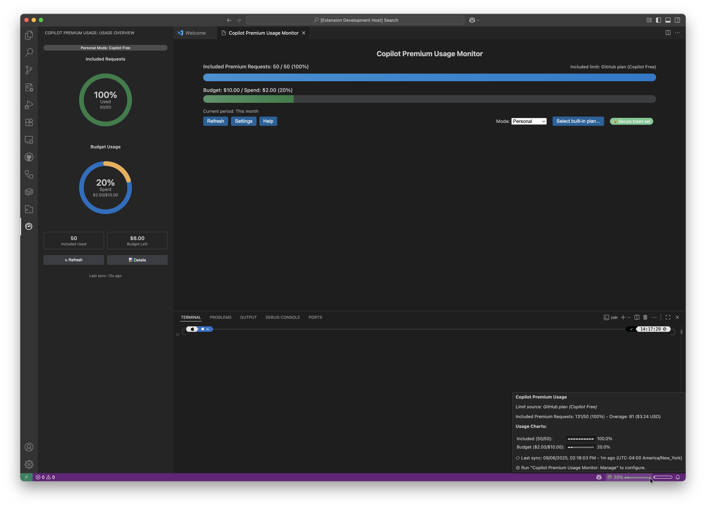

# Copilot Premium Usage Monitor


Visual Studio Code extension to view your GitHub Copilot Premium (Request SKU) usage and stay within a self‑defined monthly budget – right from the status bar & a rich panel.

---

## ⚡ Quick Start

1. Install (Marketplace search: “Copilot Premium Usage Monitor”).
2. Set `Budget` in Settings to match the budget you configured at <https://github.com/settings/billing/budgets>.
3. Personal spend: add a PAT with the `Plan: read-only` permission (Enhanced Billing).
  Org metrics: just sign in with GitHub (grants `read:org`).
4. Run command: **Copilot Premium Usage Monitor: Open**.

You’ll immediately get a status bar percentage + progress bar. Open the panel for detail, mode switching, and help.

---

## 📸 Screenshots

### Dark mode

Panel (dark) | Sidebar (dark) | Status bar (dark) | Fullscreen (dark)
---|---|---|---
 |  |  | 

### Light mode

Panel (light) | Sidebar (light) | Status bar (light) | Fullscreen (light)
---|---|---|---
 |  |  | 

---

## ✨ Key Features

- Live budget meter in status bar & panel (with color thresholds).
- Personal monthly spend (current calendar month) using Enhanced Billing.
- Organization Copilot metrics (last 28 days engaged users + total code suggestions).
- Automatic mode (choose org metrics if an org is set, else personal).
- Configurable refresh interval (auto background refresh).
- Detailed tooltip with last sync timestamp (auto updates relative time).
- Optional custom status bar icon + adaptive color / theme integration.
- Help banner (first run) to guide correct auth + PAT setup.
- Output channel logging & on‑error auto open option.
- Zero external telemetry; only talks to `api.github.com`.

---

## 🔐 Authentication & Modes

| Mode | Data Source | Required Auth | Time Window | Notes |
|------|-------------|---------------|-------------|-------|
| Personal | Enhanced Billing usage (Copilot items) | PAT (`Plan: read-only`) OR (future: GH session once supported) | Current month (UTC) | Returns 404 if Enhanced Billing not yet enabled for your account. |
| Org | Copilot org metrics API | VS Code GitHub session (`read:org`) or PAT with same scope | Last 28 days | Summarizes engaged users & code suggestions (not dollar cost). |
| Auto | Chooses Org if `org` setting is non-empty, else Personal | Based on selected path | Mixed | Falls back gracefully unless a hard error (auth/404). |

PAT scope: Use a classic or fine‑grained token that includes **Plan: read-only**. A VS Code GitHub auth session does NOT currently provide that permission for personal spend endpoints.

### Secure Storage Migration (Important)

Previous versions stored the Personal Access Token (PAT) in your settings (`copilotPremiumUsageMonitor.token`). While it was marked *machine* scope (to avoid Settings Sync) it could still:

- Sit in plain text inside `settings.json` (risking accidental commit / backup exposure).
- Be copied to crash logs or screenshots.
- Persist after you intended to clear it.

To reduce risk the extension now uses **VS Code Secret Storage** (backed by your OS keychain / credential manager). The legacy setting is **deprecated** and automatically migrated the first time a secure read/write occurs. After migration the plaintext value is cleared (unless you choose otherwise) and the token lives only in the encrypted/keychain store.

What you need to know:

| Scenario | Behavior |
|----------|----------|
| Upgrading with existing `token` value | You may see a one‑time banner / prompt offering to migrate & clear. Accept to move it securely. |
| Fresh install | Use the command palette (see below) to set the token directly into secret storage. The settings field isn’t required. |
| You re‑enter a value in the deprecated setting | A proactive guard detects it and immediately prompts to migrate or clear so it doesn’t linger in plain text. |
| Removing the token | Use the clear command – this deletes only the secret storage copy (the deprecated setting should stay empty). |

Commands related to secure storage:

- Copilot Premium Usage Monitor: Migrate Token to Secure Storage
- Copilot Premium Usage Monitor: Set / Update Token (Secure)
- Copilot Premium Usage Monitor: Clear Stored Token

Tips:

- After confirming migration you can delete any lingering line for `copilotPremiumUsageMonitor.token` from your user / workspace `settings.json` (it is no longer required).
- If you previously added the token to ignored sync settings you can keep that entry – harmless – or remove it; the extension just ignores the deprecated plaintext path now.
- If you prefer using a GitHub session for org metrics only, you can clear the token entirely; the personal spend features will pause until you set a secure token again.

Why this matters: PATs grant access to billing endpoints and can sometimes reveal account information. Keeping them out of plaintext settings reduces accidental disclosure vectors (sync, dotfile commits, remote pair sessions, screenshots) with zero extra steps after migration.

Nothing else about usage collection changes – the extension still only talks to `api.github.com` and does not transmit the token elsewhere.

### Secure Token Indicator

The panel shows a pill in the upper area once a secure token exists:

| State | Appearance | Meaning | Action |
|-------|------------|---------|--------|
| Secure token set | Green pill: “Secure token set” | Only secret storage copy exists. | None – you’re good. |
| Secure token + Plaintext in settings | Warning pill (amber / outline) with text “Secure token + Plaintext in settings” | Secret storage copy exists **and** the deprecated plaintext setting still has a value. | Click Clear Plaintext (or empty the deprecated `token` setting) to finish securing. |

If you keep the plaintext value temporarily, functionality is unchanged; the indicator just reminds you to remove the redundant risk surface. Once cleared, the indicator flips to the green secure state automatically.

---

## ⚙ Settings (prefix: `copilotPremiumUsageMonitor`)

| Setting | Type | Default | Description |
|---------|------|---------|-------------|
| `budget` | number | 10 | Monthly USD budget you configured on GitHub Billing Budgets page. |
| `mode` | enum `auto|personal|org` | auto | Data source selection. Auto = org if set, else personal. |
| `org` | string | "" | GitHub organization login for org metrics. Leave blank for personal. |
| `token` | string (machine) | "" | PAT with `Plan: read-only` for personal spend. Marked machine‑overridable to avoid sync to cloud. |
| `warnAtPercent` | number | 75 | Warning threshold (percent used). 0 disables warning color. |
| `dangerAtPercent` | number | 90 | Danger threshold. 0 disables danger color. |
| `refreshIntervalMinutes` | number | 15 | Auto refresh interval (min 5). Personal mode only currently fetches spend. |
| `statusBarAlignment` | enum `left|right` | left | Where to place status item. |
| `showLogOnError` | boolean | false | Open log channel automatically on first error. |
| `useThemeStatusColor` | boolean | true | Use theme default color when normal (higher contrast). Disable to always colorize. |
| `statusBarIconOverride` | string | "" | Optional Codicon (e.g. `graph`, `pulse`, `dashboard`). Invalid names produce a one‑time warning & banner. |
| `disableFirstRunTips` | boolean | false | Hides the first‑run info banner permanently (re‑enable via command). |

### Settings Sync Guidance

It’s safe to sync everything **except** the token. Add to ignored settings:

```jsonc
"settingsSync.ignoredSettings": ["copilotPremiumUsageMonitor.token"]
```

---

## 🧪 Commands (Command Palette)

| Command | Purpose |
|---------|---------|
| Copilot Premium Usage Monitor: Open | Show panel (primary UI). |
| Copilot Premium Usage Monitor: Sign in to GitHub | Acquire VS Code GitHub auth session (`read:org`). |
| Copilot Premium Usage Monitor: Choose Organization | Quick pick organization & store in settings. |
| Copilot Premium Usage Monitor: Manage | Open filtered settings view. |
| Copilot Premium Usage Monitor: Show Logs | Open Output Channel for diagnostics. |
| Copilot Premium Usage Monitor: Re-enable First-run Tip | Resets the dismiss state of the help banner. |

---

## 🖥 Usage Flow

1. Set `budget` and (optionally) `org`.
2. Add PAT (for personal spend) OR sign in (for org metrics).
3. Status bar shows: `icon percent% ▓▓▓░ (stale)` (stale tag appears only after errors).
4. Tooltip reveals dollars, thresholds, last (successful) sync with relative time.
5. Panel: Press Refresh, change Mode, open Settings, Help, or Sign in.

Color logic: green (under warn), yellow (>= warn), red (>= danger), error styling (API/auth failure), inheriting theme foreground if `useThemeStatusColor` is true and you’re below thresholds.

---

## 🛠 Troubleshooting & FAQ

| Symptom | Likely Cause | Fix |
|---------|--------------|-----|
| Personal spend shows 404 | Enhanced Billing not enabled | Wait until GitHub enables it for your account. |
| 403 / auth error | Missing `Plan: read-only` | Recreate PAT with required permission; paste into settings. |
| Org list empty | No org membership / missing `read:org` | Run Sign in command; verify org membership visibility. |
| Icon override ignored | Invalid Codicon name | Use a valid name from the Codicon catalog. |
| Stale tag persists | Last sync failed | Check Output Channel; resolve auth/network; manually Refresh. |
| No color (just theme fg) | `useThemeStatusColor` true | Disable that setting to always colorize usage bar. |

Extra diagnostics: run **Show Logs** (or enable `showLogOnError`).

### Token Migration Timing (Secure Storage)

The move from plaintext setting to secret storage is usually instant, but UI/state can appear to “lag” for a second or two due to VS Code’s async secret APIs. Common transient observations:

| Observation | Explanation | Action |
|-------------|-------------|--------|
| Green secure pill shows but migration hint still visible for a moment | Residual plaintext value still detected until panel re-reads post‑clear | Wait a moment or click Clear Plaintext; it will disappear automatically. |
| Warning pill (secure + plaintext) persists after you cleared the setting | Secret write finished first; panel cached prior config cycle | Trigger a manual Refresh or re-open panel; hint window will expire. |
| No secure pill immediately after setting token | Secret not yet readable; extension assumes secure for a short window | Give it ~2–3s; if still absent, run Set Token command again and check logs. |
| Secure pill remains after Clear Stored Token | Secure “assume” window (a short grace period) still active | Wait a couple seconds; if it persists, use Clear command again and look at Output Channel. |

If issues remain after ~5s: open **Show Logs**, copy any lines tagged `[secrets]`, and file an issue.

---

## 🔒 Permissions, Data & Privacy

| Functionality | Data Sent | Stored Locally | Notes |
|---------------|----------|---------------|-------|
| Personal spend | Auth header + billing usage request to `api.github.com` | Current spend, last sync ts, last error | Only Copilot usage lines aggregated. |
| Org metrics | Auth header + metrics request | Last sync ts, last error | Summaries only (engaged users & suggestions totals). |
| Status bar | None (rendering only) | Current spend / thresholds | No external logging. |

No analytics, telemetry, or third‑party endpoints. Configuration & cached values stay in your VS Code profile (globalState & settings). PAT is only stored in settings if you enter it. The extension never writes elsewhere.

See also: [SECURITY.md](./SECURITY.md).

---

## 🧩 Contributing & Development

End‑user focused README kept intentionally lean for the Marketplace.

Development, testing, release & contribution guidelines live in **[.github/DEVELOPMENT.md](./.github/DEVELOPMENT.md)**.

---

## 🗓 Changelog

See [CHANGELOG.md](./CHANGELOG.md) for versioned release notes.

---

## 📜 License

MIT – see [LICENSE](./LICENSE).

---

## ℹ Disclaimer

Not affiliated with or endorsed by GitHub. “GitHub” and “Copilot” are trademarks of their respective owners.
